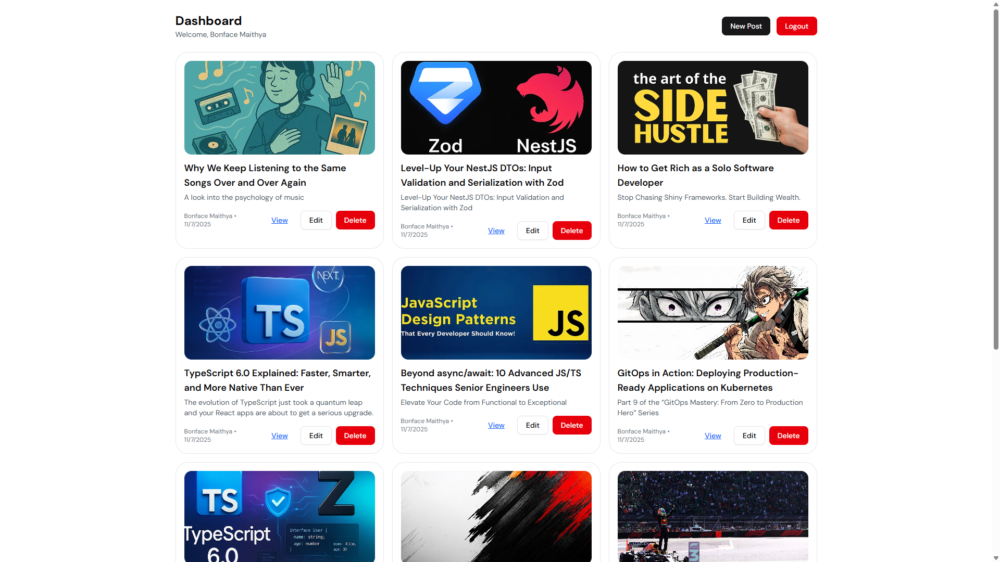

# MERN Stack Integration

This assignment focuses on building a full-stack MERN (MongoDB, Express.js, React.js, Node.js) application that demonstrates seamless integration between front-end and back-end components.

## Project Overview

You will build a blog application with the following features:
1. RESTful API with Express.js and MongoDB
2. React front-end with component architecture
3. Full CRUD functionality for blog posts
4. User authentication and authorization
5. Advanced features like image uploads and comments

## Project Structure

```
mern-blog/
├── client/                
│   ├── public/             
│   ├── src/                
│   │   ├── components/    
│   │   ├── pages/        
│   │   ├── hooks/         
│   │   ├── services/      
│   │   ├── context/        
│   │   └── App.jsx        
│   └── package.json       
├── server/                
│   ├── config/           
│   ├── controllers/    
│   ├── models/          
│   ├── routes/           
│   ├── middleware/       
│   ├── utils/            
│   ├── server.js          
│   └── package.json      
└── README.md             
```

## Getting Started

1. Accept clone the Repository
```Javascript
git clone https://github.com/Maithy-a/mern-stack-integration-Maithy-a.git
cd mern-stack-integration-Maithy-a
```
2. Install dependancies 
```Javascript
cd server
npm install
```
```Javascript
cd client
npm install
```
3. Run the application
```Javascript
cd client
npm run dev
```
```Javascript
cd server
npm run dev
```
## Screenshot

